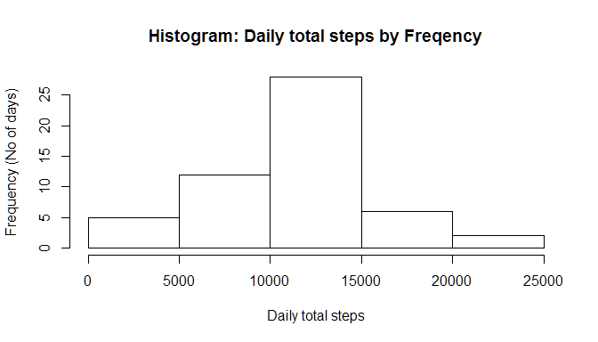
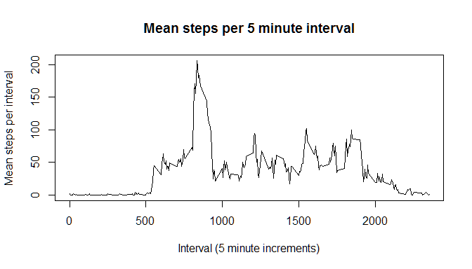
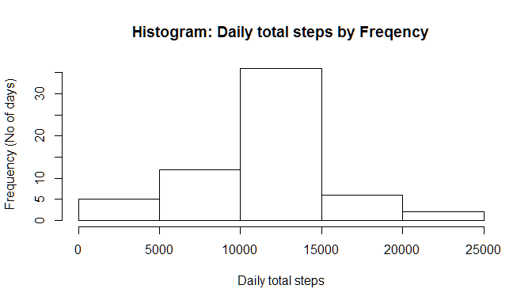
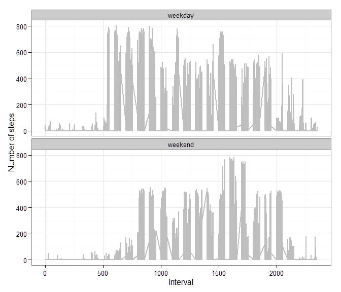

# Reproducible Research: Peer Assessment 1


Prepared by: R A Jagger (jagzuk).  
Last run at: 16:30:58 Sun Jul 19, 2015.

## Loading and preprocessing the data
Unzip and load the data:


```r
        unzip("activity.zip")
        df <- read.csv("activity.csv")
```
The first few rows of data look like this:

```r
        head(df)
```

```
##   steps       date interval
## 1    NA 2012-10-01        0
## 2    NA 2012-10-01        5
## 3    NA 2012-10-01       10
## 4    NA 2012-10-01       15
## 5    NA 2012-10-01       20
## 6    NA 2012-10-01       25
```
And a summary of the data is as follows:

```r
        summary(df)
```

```
##      steps                date          interval     
##  Min.   :  0.00   2012-10-01:  288   Min.   :   0.0  
##  1st Qu.:  0.00   2012-10-02:  288   1st Qu.: 588.8  
##  Median :  0.00   2012-10-03:  288   Median :1177.5  
##  Mean   : 37.38   2012-10-04:  288   Mean   :1177.5  
##  3rd Qu.: 12.00   2012-10-05:  288   3rd Qu.:1766.2  
##  Max.   :806.00   2012-10-06:  288   Max.   :2355.0  
##  NA's   :2304     (Other)   :15840
```


## What is mean total number of steps taken per day?
Calculate the total number of steps taken per day:

```r
        df.bydate <- aggregate(steps ~ date, data=df, FUN=sum, na.rm=TRUE)
        head(df.bydate)
```

```
##         date steps
## 1 2012-10-02   126
## 2 2012-10-03 11352
## 3 2012-10-04 12116
## 4 2012-10-05 13294
## 5 2012-10-06 15420
## 6 2012-10-07 11015
```

Make a histogram of the total number of steps taken each day:


```r
        hist(df.bydate$steps, xlab="Daily total steps", ylab="Frequency (No of days)",main="Histogram: Daily total steps by Freqency")
```

 

Calculate and report the mean and median of the total number of steps taken per day:


```r
        daily.mean <- format(round(mean(df.bydate$steps)),nsmall=0)
        daily.median <- format(round(median(df.bydate$steps)),nsmall=0)
```

The mean number of steps taken per day is 10766 and the median is 10765.

## What is the average daily activity pattern?

Make a time series plot (i.e. type = "l") of the 5-minute interval (x-axis) and the average number of steps taken, averaged across all days (y-axis):


```r
        df.byInterval <- aggregate(steps ~ interval, data=df, FUN=mean, na.rm=TRUE)
        head(df.byInterval)
```

```
##   interval     steps
## 1        0 1.7169811
## 2        5 0.3396226
## 3       10 0.1320755
## 4       15 0.1509434
## 5       20 0.0754717
## 6       25 2.0943396
```


```r
        plot(steps~interval,data=df.byInterval,type="l",  xlab="Interval (5 minute increments)", ylab="Mean steps per interval",  main="Mean steps per 5 minute interval")
```

 

Which 5-minute interval, on average across all the days in the dataset, contains the maximum number of steps?


```r
        interval.max <- df.byInterval$interval[which.max(df.byInterval$steps)]
```
The 5-minute period with the maximum number of steps is interval 835

## Imputing missing values
Calculate and report the total number of missing values in the dataset (i.e. the total number of rows with NAs).


```r
        df.naRows <- sum(is.na(df)) 
```
There are 2304 rows with missing values (NAs).

Devise a strategy for filling in all of the missing values in the dataset:  
*The missing values will be replaced with the mean for that 5-minute interval.*

Create a new dataset that is equal to the original dataset but with the missing data filled in.


```r
        df.new <- merge(df, df.byInterval, by="interval", suffixes=c("",".mean"))
        head(df.new)
```

```
##   interval steps       date steps.mean
## 1        0    NA 2012-10-01   1.716981
## 2        0     0 2012-11-23   1.716981
## 3        0     0 2012-10-28   1.716981
## 4        0     0 2012-11-06   1.716981
## 5        0     0 2012-11-24   1.716981
## 6        0     0 2012-11-15   1.716981
```

```r
# create a bolean vector of the nas
        df.new.nas <- is.na(df.new$steps)
        head(df.new.nas)
```

```
## [1]  TRUE FALSE FALSE FALSE FALSE FALSE
```

```r
# replace the nas with the mean values
        df.new$steps[df.new.nas] <- df.new$steps.mean[df.new.nas]
        head(df.new)
```

```
##   interval    steps       date steps.mean
## 1        0 1.716981 2012-10-01   1.716981
## 2        0 0.000000 2012-11-23   1.716981
## 3        0 0.000000 2012-10-28   1.716981
## 4        0 0.000000 2012-11-06   1.716981
## 5        0 0.000000 2012-11-24   1.716981
## 6        0 0.000000 2012-11-15   1.716981
```

```r
# remove the 'old' column that had the nas
        df.new <- df.new[,c(1:3)]
        head(df.new)
```

```
##   interval    steps       date
## 1        0 1.716981 2012-10-01
## 2        0 0.000000 2012-11-23
## 3        0 0.000000 2012-10-28
## 4        0 0.000000 2012-11-06
## 5        0 0.000000 2012-11-24
## 6        0 0.000000 2012-11-15
```

Make a histogram of the total number of steps taken each day:


```r
        df.new.bydate <- aggregate(steps ~ date, data=df.new, FUN=sum)
        head(df.new.bydate)
```

```
##         date    steps
## 1 2012-10-01 10766.19
## 2 2012-10-02   126.00
## 3 2012-10-03 11352.00
## 4 2012-10-04 12116.00
## 5 2012-10-05 13294.00
## 6 2012-10-06 15420.00
```

```r
        hist(df.new.bydate$steps, xlab="Daily total steps", ylab="Frequency (No of days)",main="Histogram: Daily total steps by Freqency")
```

 

Calculate and report the mean and median of the total number of steps taken per day:


```r
        daily.mean.new <- format(round(mean(df.new.bydate$steps)),nsmall=0)
        daily.median.new <- format(round(median(df.new.bydate$steps)),nsmall=0)
```

The mean number of steps taken per day is 10766 and the median is 10766.

Do these values differ from the estimates from the first part of the assignment? What is the impact of imputing missing data on the estimates of the total daily number of steps?

The effect of imputing the missing values is as follows:


```r
        daily.mean.impact <- as.numeric(daily.mean.new) - as.numeric(daily.mean)
        daily.median.impact <- as.numeric(daily.median.new) - as.numeric(daily.median)
```
- The daily mean has changed by 0 from 10766 to 10766.
- The daily median has changed by 1 from 10765 to 10766.  

## Are there differences in activity patterns between weekdays and weekends?

Create a new factor variable in the dataset with two levels - "weekday" and "weekend" indicating whether a given date is a weekday or weekend day.  


```r
# function to return "weekday"" or "weekend"" from a given date
        daytype <- function(date) {
        if (weekdays(as.Date(date)) %in% c("Saturday", "Sunday")) {
                "weekend"
         } else {
                "weekday"
                }
        }

# use sapply to apply the function to all rows
        df.new$daytype <- as.factor(sapply(df.new$date, daytype))
        head(df.new)
```

```
##   interval    steps       date daytype
## 1        0 1.716981 2012-10-01 weekday
## 2        0 0.000000 2012-11-23 weekday
## 3        0 0.000000 2012-10-28 weekend
## 4        0 0.000000 2012-11-06 weekday
## 5        0 0.000000 2012-11-24 weekend
## 6        0 0.000000 2012-11-15 weekday
```


Make a panel plot containing a time series plot (i.e. type = "l") of the 5-minute interval (x-axis) and the average number of steps taken, averaged across all weekday days or weekend days (y-axis).


```r
#ggplot will produce a chart most like the given example
        library(ggplot2)
        ggplot(df.new, aes(x=interval, y=steps)) + 
        geom_line(color="grey", size=1) + 
                facet_wrap(~ daytype, nrow=2, ncol=1) +
                labs(x="Interval", y="Number of steps") +
                theme_bw()
```

 
  
*End of document.*

